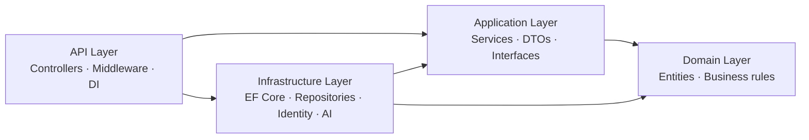
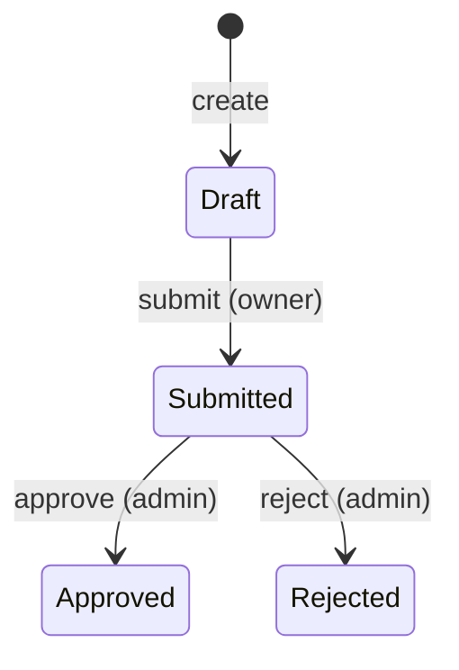

# ReceiptScout

> A receipt-tracking and expense-report API with AI-assisted BAS-account categorization, built for Swedish small businesses — with a React front end.

[](https://github.com/ElvisNilssonDev/ReceiptScout/actions/workflows/ci.yml)
[](https://github.com/ElvisNilssonDev/ReceiptScout/actions/workflows/deploy-frontend.yml)


**🔗 Live demo:** https://elvisnilssondev.github.io/ReceiptScout/

> The deployed front end is hosted on GitHub Pages. The UI renders fully; sign-in and CRUD require a running API (the demo points at a local API by default — see [Running locally](#running-locally)).

---

## About

ReceiptScout lets a small business register receipts, group them into expense reports, and route those reports through an approval flow. Each receipt can be mapped to a **BAS account** (the Swedish standardized chart of accounts), and an **AI categorization seam** suggests the most likely account for a given receipt.

It was built as a full-stack assignment: a layered .NET Web API with a separate xUnit test project, plus a React front end, in a single monorepo.

The application UI is in **Swedish**; the codebase and this document are in English.

---

## Features

**Authentication & roles**
- Register / login with JWT bearer tokens (ASP.NET Core Identity)
- Two roles — `Admin` and `User` — with role-gated UI and server-side authorization
- Login/register endpoints are rate-limited

**Receipts**
- Full CRUD, scoped to the signed-in user
- Assign each receipt to a category and an expense report via dropdowns (no GUID juggling)
- **"Suggest category"** button → AI seam returns a BAS account + confidence + rationale

**Categories (BAS accounts)**
- Full CRUD (admin-managed), seeded with 12 standard BAS expense accounts
- VAT rate per category (25 % / 12 % / 6 % / 0 %)

**Expense reports**
- Full CRUD plus a status state machine: **Draft → Submitted → Approved / Rejected**
- Owners submit; admins approve/reject; admins see every report (approval queue)
- Open a report to see its receipts and totals (sum + VAT)

**Platform**
- Dashboard with live metrics (receipt count, totals, VAT, pending reports)
- Global exception handling (RFC 7807 problem details), security headers, CORS
- `/health` endpoint with an EF Core database check
- Swagger UI for exploring the API

---

## Tech stack

| Area        | Technologies |
|-------------|--------------|
| **Backend** | C# 14 · .NET 10 · ASP.NET Core Web API · EF Core 10 · SQL Server Express · ASP.NET Core Identity · JWT Bearer · FluentValidation · Swashbuckle (Swagger) · Health Checks · Rate Limiting |
| **Frontend**| React 19 · TypeScript · Vite · Tailwind CSS v4 · shadcn/ui · React Router (HashRouter) · lucide-react |
| **Testing** | xUnit · NSubstitute · Shouldly |
| **DevOps**  | GitHub Actions (CI build + test, CD deploy) · GitHub Pages |

---

## Architecture

ReceiptScout follows **Clean Architecture** with four backend projects and a separate test project. Dependencies point inward toward the Domain.



- **Domain** — entities and business rules (e.g. the expense-report state machine lives in the entity, not a service).
- **Application** — service interfaces + implementations, DTOs, and the AI categorization seam. No infrastructure dependencies.
- **Infrastructure** — EF Core `DbContext`, the **generic repository** + concrete repositories, Identity, JWT, and the AI provider implementation.
- **API** — controllers (depending on service **interfaces** via DI), middleware, and composition root.

Controllers depend on interfaces only; all services and repositories are registered via interfaces in the DI container. **CQRS/MediatR is intentionally not used** — the request path is `Controller → Service (interface) → Repository (interface) → EF Core`.

### AI categorization seam

`IAiCategorizationService` is a provider seam. The current implementation (`StubAiCategorizationService`) does naive keyword matching; swapping in a real LLM (e.g. Gemini) is a single DI line with no controller or front-end changes. The request is *grounded* — the AI only chooses from categories that actually exist.

---

## Domain model

Three core entities with one-to-many relationships:

- **Category** — a BAS account (`name`, `basAccount`, `vatRate`)
- **Receipt** — `merchant`, `date`, `totalAmount`, `vatAmount`, optional `category` and `expenseReport`
- **ExpenseReport** — `title`, `status`, owner, optional approving admin; holds many receipts

```
Category   1 ──── *  Receipt  * ──── 1   ExpenseReport
```

Expense-report status flow:



Title is editable only while in `Draft`; transitions are enforced in the domain entity.

---

## API endpoints

All endpoints require a JWT unless noted. Base path: `/api`.

| Method | Route | Auth | Description |
|--------|-------|------|-------------|
| POST | `/Auth/register` | Public · rate-limited | Register, returns JWT |
| POST | `/Auth/login` | Public · rate-limited | Login, returns JWT |
| GET | `/Categories` | User | List categories |
| POST | `/Categories` | Admin | Create category |
| PUT | `/Categories/{id}` | Admin | Update category |
| DELETE | `/Categories/{id}` | Admin | Delete category |
| GET | `/Receipts` | User | List own receipts |
| GET | `/Receipts/{id}` | User | Get a receipt |
| POST | `/Receipts` | User | Create receipt |
| PUT | `/Receipts/{id}` | User | Update receipt |
| DELETE | `/Receipts/{id}` | User | Delete receipt |
| POST | `/Receipts/{id}/suggest-category` | User | AI category suggestion |
| GET | `/ExpenseReports` | User (own) / Admin (all) | List reports |
| GET | `/ExpenseReports/{id}` | Owner/Admin | Get a report |
| POST | `/ExpenseReports` | User | Create report |
| PUT | `/ExpenseReports/{id}` | Owner/Admin | Update title (Draft only) |
| DELETE | `/ExpenseReports/{id}` | Owner/Admin | Delete report |
| POST | `/ExpenseReports/{id}/submit` | Owner | Draft → Submitted |
| POST | `/ExpenseReports/{id}/approve` | Admin | Submitted → Approved |
| POST | `/ExpenseReports/{id}/reject` | Admin | Submitted → Rejected |
| GET | `/ExpenseReports/{id}/receipts` | Owner/Admin | Receipts in a report |
| GET | `/health` | Public | Health + DB check |

Interactive docs: run the API and open **`/swagger`**.

---

## Running locally

### Prerequisites
- [.NET 10 SDK](https://dotnet.microsoft.com/download)
- [Node.js 20+](https://nodejs.org/)
- SQL Server Express (or adjust the connection string)

### Backend

```bash
# from the repo root
dotnet run --project api/src/ReceiptScout.Api
```

On startup the app applies EF Core migrations and **seeds** the database (roles, an admin user, and the 12 BAS categories) automatically. The API runs on `https://localhost:7161` with Swagger at `/swagger`.

Connection string (in `api/src/ReceiptScout.Api/appsettings.json`):

```
Server=.\SQLEXPRESS;Database=ReceiptScout;Trusted_Connection=True;TrustServerCertificate=True;
```

**Seeded admin account:**

| Email | Password |
|-------|----------|
| `admin@receiptscout.local` | `Admin123!` |

(Override via `Seed:AdminEmail` / `Seed:AdminPassword` in configuration.)

### Frontend

```bash
cd frontend
npm install
npm run dev          # http://localhost:5173
```

The front end reads the API base URL from `VITE_API_URL` (defaults to `https://localhost:7161`):

```bash
# frontend/.env.local
VITE_API_URL=https://localhost:7161
```

---

## Tests

A separate xUnit project (`api/tests/ReceiptScout.Application.Tests`) covers the services and domain rules. Services are tested by mocking repository interfaces with **NSubstitute**; tests follow the Arrange-Act-Assert pattern.

```bash
dotnet test api/tests/ReceiptScout.Application.Tests/ReceiptScout.Application.Tests.csproj
```

Coverage includes happy paths, authorization checks, validation, and the expense-report state machine.

---

## CI / CD

Two GitHub Actions workflows run on every push:

- **`ci.yml`** — restores, builds the API, and runs all xUnit tests.
- **`deploy-frontend.yml`** — builds the React app and deploys it to **GitHub Pages**.

---

## Project structure

```
.
├── api/
│   ├── src/
│   │   ├── ReceiptScout.Api/            # Controllers, middleware, Program.cs
│   │   ├── ReceiptScout.Application/    # Services, DTOs, interfaces, AI seam
│   │   ├── ReceiptScout.Domain/         # Entities, enums, business rules
│   │   └── ReceiptScout.Infrastructure/ # EF Core, repositories, Identity, seeding
│   └── tests/
│       └── ReceiptScout.Application.Tests/
├── frontend/
│   └── src/
│       ├── app/                         # Router, dashboard
│       ├── components/                  # Layout + shadcn/ui
│       ├── features/                    # receipts, categories, expense-reports, auth
│       └── lib/                         # api client, auth, types, formatting
└── .github/workflows/                   # ci.yml, deploy-frontend.yml
```

---

## Roadmap

- [ ] Swap the stub AI for a real LLM (Gemini) via the existing seam
- [ ] Deploy the API (e.g. Railway + PostgreSQL) for a fully working live demo
- [ ] Receipt image upload (currently a URL field)
- [ ] Owner column in the admin approval queue
- [ ] Toasts and loading skeletons; mobile-responsive sidebar

---

## License

MIT — see [`LICENSE`](LICENSE).

## Author

**Elvis Nilsson** — [GitHub](https://github.com/ElvisNilssonDev)
